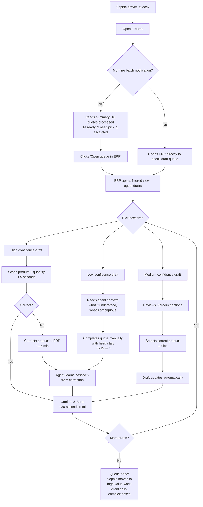
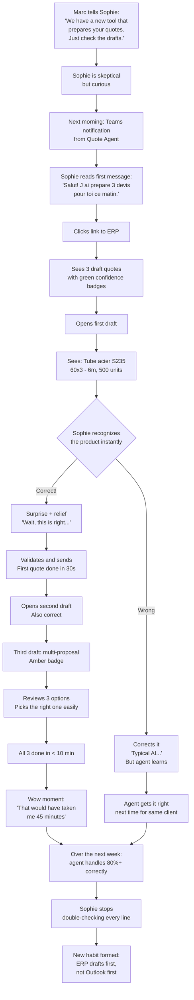
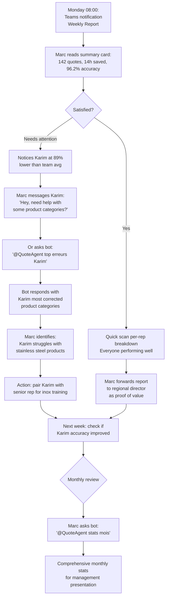
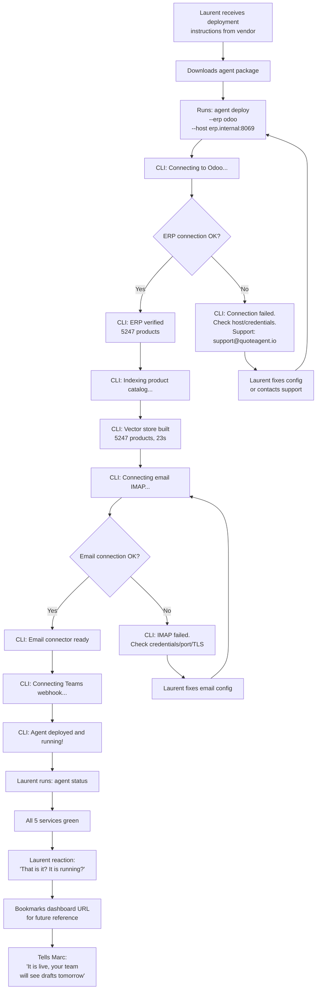
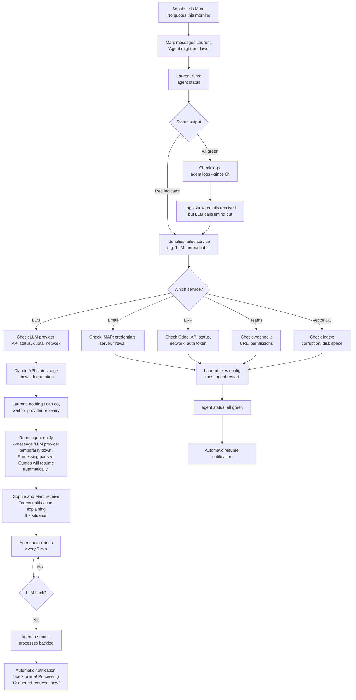

# UX Design Specification ai-quote-agent

**Author:** Khalil
**Date:** 2026-03-15

---

<!-- UX design content will be appended sequentially through collaborative workflow steps -->

## Executive Summary

### Project Vision

AI Quote Agent is an autonomous AI agent that processes B2B quote requests end-to-end: from email reception to draft quote creation in the ERP. The UX philosophy is "invisible agent" — the agent works silently in the background, and users interact only with the output (draft quotes in the ERP) and edge cases (multi-proposals or escalations). The product targets industrial companies with messy product catalogs and complex ERP ecosystems, with a self-hosted-first deployment model.

The core UX paradigm: the best interface is no interface. The agent should feel like having a skilled junior colleague who prepares everything before you arrive at your desk.

### Target Users

**Primary: Inside Sales Reps (Sophie archetype)**
- Sedentary sales reps ("chargés de clientèle" / ADV) in regional agencies
- Daily tools: Outlook + ERP (SAP, Odoo, Dynamics) + Teams
- Process ~30 quote request emails/day, 3-20 min each
- Tech-savvy with deep catalog knowledge, but drowning in repetitive work
- Desktop-first workflow — these are sedentary roles, not field sales (itinerant reps have different responsibilities and are out of scope)
- Success = draft quotes ready to validate in the ERP without learning a new tool

**Secondary: Sales Manager (Marc archetype)**
- Regional sales director overseeing multiple reps/agencies
- Needs visibility into team performance, quote speed, accuracy, and volume
- All KPIs matter: average processing time, accuracy rate, volume per rep, correction rate
- Success = faster quotes, fewer errors, lower turnover, data-driven team management

**Tertiary: IT Operations (Laurent archetype)**
- Deploys, integrates, and monitors the solution
- Wants zero-hassle deployment: install, connect ERP, it works
- Security-first: data stays on-premise, minimal attack surface
- Needs responsive support when issues arise — not self-service documentation hunting
- Success = deploy once, monitor passively, escalate quickly if needed

### Key Design Challenges

1. **Invisible interaction model** — The agent must work in the background with zero required interaction during processing. The only touchpoints are post-processing: notifications (Teams) and draft quotes in the ERP. Designing for "no UI" is harder than designing a UI.

2. **Trust through transparency** — Sales reps receive AI-generated draft quotes they didn't build. The agent must provide just enough reasoning context (confidence level, matched products, key decisions) to enable fast validation without overwhelming the user. Three distinct validation experiences map to the confidence tiers: ready-to-send, choose-from-options, and human-takeover.

3. **Multi-ERP surface consistency** — Quote validation happens inside the ERP (Odoo for MVP, SAP/Dynamics/Oracle later). The monitoring dashboard exists outside the ERP. UX must be coherent across both surfaces and anticipate multi-ERP from day one.

4. **Frictionless IT deployment** — Installation and ERP connection must feel immediate and safe. Guided setup wizard, built-in connectivity tests, health monitoring, and fast human support for edge cases.

### Design Opportunities

1. **The Ghost Agent paradigm** — Competitive UX advantage through absence of interface. No new software to learn. Drafts appear in the ERP as if a colleague prepared them. The agent's best UX is being invisible.

2. **One-click validation for uncertain cases** — When the agent isn't sure, present 2-3 product options via Teams notification or enriched ERP view. One click to select, done. Useful even when the agent is imprecise.

3. **Manager dashboard as value proof** — A clean, non-intrusive dashboard showing time saved, accuracy trends, and team volume. Sells the product to leadership and helps Marc manage without micromanaging.

4. **Guided deployment wizard** — 3-step max installation with built-in ERP connectivity tests, health checks, and immediate support escalation. Makes Laurent's life easy and reduces onboarding friction for new clients.

## Core User Experience

### Defining Experience

The core experience of AI Quote Agent is defined by a single loop:

**The Validation Loop (Sophie's daily experience):**
1. Agent processes incoming quote request email autonomously (invisible)
2. Draft quote appears in ERP as a ready-to-review document
3. Sophie receives a Teams notification: casual, human tone — "Hey, I prepared this quote, check it when you have time" with a direct link to the ERP draft
4. Sophie opens the ERP, reviews the draft (2-3 minutes max)
5. Sophie validates and sends to the client

This is the ONE interaction that defines the product's value. Everything else is secondary.

**Confidence tier sub-experiences:**
- **High confidence (>85%)**: Steps 1-5 as described — the default, most frequent path
- **Medium confidence (50-85%)**: Same flow, but the draft includes 2-3 product options with the agent's reasoning. Sophie picks one, the rest is the same
- **Low confidence (<50%)**: Agent flags the request as needing human expertise, provides enriched context (what it understood, what it's unsure about). Sophie takes over manually but with a head start

### Platform Strategy

**Platform philosophy: No new tools.**

Every interaction happens inside tools users already know:

| User | Primary Surface | Secondary Surface | No New Tool |
|------|----------------|-------------------|-------------|
| Sophie (Sales Rep) | ERP (Odoo → SAP/Dynamics/Oracle) | Teams notifications | ✅ |
| Marc (Sales Manager) | Teams (bot commands or automated reports) | Email weekly digest | ✅ |
| Laurent (IT Ops) | CLI for deployment & daily ops | Lightweight web UI for diagnostics only | ✅ (CLI is native) |

**Platform decisions:**
- **Desktop-first**: Sedentary sales reps work on desktop. No mobile-specific design needed for MVP
- **ERP-embedded validation**: Quote review and send happens entirely within the ERP — no redirects to external tools
- **Teams as notification channel**: Casual, human-toned messages with direct ERP links. Not a chat interface — one-way notifications
- **Manager insights via Teams bot**: On-demand KPIs via bot commands (@agent stats, @agent weekly) and/or automated weekly reports. No separate dashboard
- **CLI-first IT operations**: Deployment, configuration, health checks via CLI. Lightweight diagnostic web UI available for troubleshooting but not required for daily operations
- **Multi-ERP ready**: UX patterns designed to be ERP-agnostic from day one. The validation experience adapts to each ERP's native UI conventions
- **Always-online assumption**: Network connectivity assumed. Rare outages handled gracefully (queued processing, retry) but no offline-first design

### Effortless Interactions

**What must feel effortless:**

1. **Email → Draft quote**: Completely invisible. Zero user involvement. The agent handles everything from email reception to ERP draft creation without any human touchpoint.

2. **Notification → ERP draft**: One click from Teams notification to the right quote in the ERP. No searching, no navigation, no context switching.

3. **Review → Send**: The draft quote in the ERP must be complete enough that Sophie only needs to scan it and hit send. If review consistently takes more than 2-3 minutes, something is wrong.

4. **Multi-proposal selection**: When the agent offers options, selecting one should be a single action — not a multi-step flow.

5. **Deployment → Operational**: Laurent runs a CLI command, connects ERP credentials, the agent starts working. No configuration marathon.

**What the agent eliminates entirely:**
- Navigating the product catalog manually
- Building quotes from scratch in the ERP
- Remembering client preferences and history
- Cross-referencing product availability and proposability

### Critical Success Moments

1. **"The quotes are already done" moment** — Sophie's first morning where she opens her ERP and finds draft quotes waiting. This is the moment that sells the product. If this feels magical, adoption follows.

2. **"It got the right product" moment** — Sophie reviews a draft and the product match is exactly what she would have chosen. This builds trust. If the first 5-10 quotes are accurate, Sophie stops second-guessing the agent.

3. **"I just hit send" moment** — The validation takes 2 minutes, not 15. Sophie realizes she's doing in 2 hours what used to take all morning. This is the retention moment.

4. **"It knew what the client wanted" moment** — A recurring client sends a vague request ("same as last time"), and the agent handles it correctly using client memory. This is the delight moment.

**Make-or-break flows:**
- If the first quote Sophie reviews is wrong, trust is damaged for weeks
- If Teams notifications are noisy or unhelpful, Sophie mutes them and the whole UX collapses
- If ERP draft creation fails or is incomplete, the agent creates more work instead of less

### Experience Principles

1. **Invisible until useful** — The agent should never demand attention. It works silently and only surfaces when there's something for the user to act on. No dashboards to check, no queues to monitor, no status pages to refresh.

2. **Trust through accuracy, not explanation** — Users build trust by seeing correct results, not by reading reasoning traces. Show confidence levels subtly, but lead with the answer. Explanations are available on demand, never forced.

3. **2-minute validation or something's wrong** — If a sales rep spends more than 2-3 minutes on a single quote review, the agent has failed. Every UX decision should optimize for minimal validation time.

4. **Live where users live** — Every interaction happens in tools users already use daily (ERP, Teams, CLI). The moment we ask a user to open a new app or learn a new interface, we've added friction instead of removing it.

5. **Graceful degradation of autonomy** — High confidence → ready to send. Medium → choose from options. Low → enriched handoff. The experience degrades gracefully, never abruptly. Even when the agent can't solve it, the user gets a head start.

## Desired Emotional Response

### Primary Emotional Goals

**The WOW Engine** — The primary emotional driver across all users is the "wow effect": the moment where the product exceeds expectations and feels almost magical. This is the emotion that drives word-of-mouth adoption and long-term retention.

| User | Primary Emotion | Secondary Emotion | Trigger Moment |
|------|----------------|-------------------|----------------|
| Sophie | Confidence + Surprise ("wow, it's already done AND it's right") | Efficiency + Relief (less pressure on quotes) | First morning with draft quotes waiting in ERP |
| Marc | Control + Satisfaction ("it's running smoothly") | Mastery (data-driven team management) | First weekly stats showing measurable improvement |
| Laurent | Serenity + Surprise ("it just works, first try") | Trust (nothing broke, data is safe) | Deployment completes and first quote processes successfully |

### Emotional Journey Mapping

**Sophie's Emotional Arc:**

| Stage | Emotion | Design Implication |
|-------|---------|-------------------|
| **Discovery** | Skepticism → Curiosity | "An AI that does my quotes? Yeah right..." — demo must show real messy cases, not clean ones |
| **First quote reviewed** | Surprise → Wow | The draft must be impressively accurate on the first interaction. No second chance for first impressions |
| **First week** | Surprise → Confidence | Repeated accuracy builds trust. Sophie stops double-checking every line item |
| **Daily use** | Efficiency + Relief | The wow fades into comfortable routine. The pressure is gone. She does in 2h what took all morning |
| **Agent error** | Acceptance, not frustration | "This was objectively a hard case" — the agent must frame its limitations honestly so Sophie attributes the error to difficulty, not incompetence |
| **Returning daily** | Calm confidence | The agent is a reliable colleague. No anxiety about what it might have gotten wrong overnight |

**Marc's Emotional Arc:**

| Stage | Emotion | Design Implication |
|-------|---------|-------------------|
| **First stats report** | Satisfaction + Control | Clear, immediate proof that the team is faster and more accurate |
| **Ongoing** | Mastery | He knows his numbers, sees trends, can act on data instead of gut feeling |

**Laurent's Emotional Arc:**

| Stage | Emotion | Design Implication |
|-------|---------|-------------------|
| **Deployment** | Serenity + Surprise | "That's it? It's running?" — must feel anticlimactically simple |
| **Ongoing** | Peace of mind | No news is good news. The system runs, health checks pass, nothing to worry about |
| **Issue occurs** | Supported, not alone | Fast human support response. He's never stuck debugging by himself |

### Micro-Emotions

**Critical micro-emotions to cultivate:**

- **Confidence over confusion** — Every agent output must be clear and self-explanatory. Sophie should never look at a draft and think "what is this?"
- **Trust over skepticism** — Built through consistent accuracy, not through explanations. Show the result, not the reasoning (unless asked)
- **Accomplishment over frustration** — When Sophie sends 15 validated quotes before lunch, she should feel like a high performer, not like a button-pusher
- **Delight over mere satisfaction** — The wow effect must be maintained through subtle touches: the agent remembering a client preference, handling a tricky case correctly, improving over time

**Micro-emotions to actively prevent:**

- **Anxiety** — "Did the agent mess up a quote I already sent?" → Self-review + confidence tiers prevent this
- **Helplessness** — "The agent is doing everything, what's my value?" → Sophie's expertise is elevated (complex cases, client relationships), not replaced
- **Distrust** — "I need to check everything anyway" → If this happens, the product has failed. Accuracy is the only cure
- **Annoyance** — "Another notification from this thing" → Notifications must be useful, infrequent enough, and actionable. Never noisy

### Design Implications

**Emotion → Design connections:**

| Desired Emotion | UX Design Approach |
|----------------|-------------------|
| **Wow / Surprise** | First-run experience must be flawless. Show the hardest case that worked, not the easiest. The agent's casual Teams tone ("Hey, I did this quote for you") adds personality to the wow |
| **Confidence** | Subtle confidence indicators on each draft (not intrusive scores, but a simple visual cue). Consistent accuracy over time. No false positives — better to escalate than to be wrong |
| **Relief / Less pressure** | Quantify the impact: "You've saved X hours this week" in weekly Teams digest to Marc and optionally Sophie. Make the benefit tangible |
| **Acceptance of errors** | When the agent escalates or gets corrected, frame the context: "This request had ambiguous product references" — honest about difficulty, not defensive. The commercial must feel the error was legitimate, not lazy |
| **Serenity (Laurent)** | Health check outputs must be boringly green. Deployment logs must be clean and predictable. Support response time must be fast |
| **Control (Marc)** | Stats must be real-time or near-real-time. Marc asks, Marc gets an answer immediately. No "report will be ready tomorrow" |

### Emotional Design Principles

1. **Wow first, trust always** — The initial experience must generate surprise and delight. Every subsequent interaction must reinforce trust through accuracy. Wow gets them in the door, trust keeps them.

2. **Errors are hard cases, not failures** — When the agent can't handle a request, the UX must frame it as objective difficulty, not agent incompetence. Honest confidence tiers, clear escalation context, and transparent limitations build respect rather than frustration.

3. **Efficiency should feel like freedom** — Sophie shouldn't feel like she's been automated out of a job. She should feel like the boring part disappeared and she can finally focus on what she's good at — client relationships, complex technical advice, high-value work.

4. **Silence is golden** — The absence of interruption IS the emotional design. The agent doesn't demand attention, doesn't celebrate its own work, doesn't send unnecessary updates. Calm reliability is the emotional baseline.

5. **Make the value undeniable** — Periodically surface concrete metrics: time saved, quotes processed, accuracy rate. Not to brag, but to make the wow effect measurable. When Sophie tells a colleague "you need this", she should have a number to cite.

## UX Pattern Analysis & Inspiration

### Inspiring Products Analysis

**1. Microsoft Teams — Notification & Bot Patterns**

Teams is already in Sophie's daily workflow. Its bot and notification patterns are directly relevant:
- **Adaptive Cards**: Rich, actionable notifications that let users take action without leaving Teams. A quote notification with a "View in ERP" button is a native Teams pattern
- **Bot commands**: Marc can query stats with @mentions — a familiar interaction model, no new tool to learn
- **Quiet notifications**: Teams allows priority levels. The agent should use standard priority for routine quotes, urgent only for escalations
- **What works**: Contextual, actionable, non-intrusive. Users already know how to interact with bots and cards
- **What to borrow**: Adaptive Card format for quote notifications, bot command pattern for manager KPIs

**2. Outlook — Email Processing Paradigm**

Outlook is the entry point for quote requests. The agent replaces manual email processing:
- **Rules & automation feel**: Outlook users are familiar with rules that auto-sort, flag, and categorize. The agent extends this mental model — "my emails get processed automatically"
- **Focused Inbox pattern**: Outlook separates important from noise. The agent does the same but for quote requests — simple cases are handled, complex ones surface for attention
- **What works**: Users trust automation they've configured (Outlook rules). The agent should feel like a smarter, more capable version of that
- **What to borrow**: The mental model of "background automation I trust" rather than "tool I need to operate"

**3. ERP Native Patterns (SAP/Odoo/Dynamics)**

The validation experience lives inside the ERP. Must respect ERP conventions:
- **Draft status workflows**: Every ERP has a draft → confirmed → sent pipeline. The agent creates at the draft stage — a familiar, safe pattern
- **Audit trails**: ERPs log who did what. Agent actions should appear in the same audit trail as human actions
- **List views & filters**: Sales reps navigate quotes via list views. Agent-prepared quotes should be filterable ("show me agent drafts")
- **What works**: ERPs are boring and reliable. Users trust them precisely because they're predictable
- **What to borrow**: Draft workflow conventions, native notification mechanisms, filter/tag patterns for agent-prepared items

**4. "Ghost" Automation Products — Paradigm Inspiration**

Products where the best UX is invisibility:
- **Spam filters (Gmail/Outlook)**: The most successful AI product ever deployed. Users don't "use" a spam filter — it just works. Quote processing should feel the same
- **Autocomplete/Smart Compose**: Suggestions appear naturally in context. The agent's multi-proposals follow this pattern — options presented where you're already working
- **Background sync (Dropbox/OneDrive)**: Files sync without user intervention. The agent processes quotes the same way — silently, reliably, with occasional status indicators
- **What works**: Users trust invisible systems when they're consistently accurate. Trust erodes instantly when they fail silently
- **What to borrow**: The "it just works" paradigm. Minimal UI, maximum reliability. Surface only when user attention is needed

### Transferable UX Patterns

**Notification Patterns:**
- **Teams Adaptive Cards** → Quote completion notifications with direct ERP link, confidence indicator, and client/product summary. Actionable without opening another app
- **Batched notifications** → Don't send 30 individual notifications for 30 quotes. Batch: "I've processed 12 quotes this morning, 10 ready to send, 2 need your input"

**Interaction Patterns:**
- **Draft-first workflow** → Agent always creates drafts, never sends. Same pattern as ERP draft status — safe, reversible, familiar
- **Progressive disclosure** → Show confidence level and key info upfront. Reasoning details available on demand (expand/drill-down), never forced
- **One-click selection** → For multi-proposals: 3 product options, select one, done. Inspired by autocomplete selection patterns

**Automation Patterns:**
- **Spam filter paradigm** → Work invisibly, surface only exceptions. The gold standard for background AI
- **Confidence indicators** → Subtle visual cues (green/orange/red or checkmark/question/flag) borrowed from email spam confidence scoring — not intrusive numeric scores

**IT Operations Patterns:**
- **Docker-style CLI** → Simple, verb-based commands: `agent deploy`, `agent status`, `agent logs`. Predictable, scriptable, no GUI required
- **Health check dashboard** → Borrowed from infrastructure monitoring: green/red status indicators, accessible via URL when needed, not a daily tool

### Anti-Patterns to Avoid

| Anti-Pattern | Why It's Dangerous | Our Approach Instead |
|-------------|-------------------|---------------------|
| **Separate dashboard for everything** | Adds a new tool to learn. Sophie won't open it. Marc might, once, then forget | Live where users live — ERP + Teams + CLI |
| **Verbose AI explanations** | "I selected this product because..." walls of text kill trust instead of building it | Lead with the answer. Reasoning on demand only |
| **Notification spam** | One notification per quote × 30 quotes/day = muted in a week | Batch notifications with smart grouping |
| **Mandatory confirmation flows** | "Are you sure?" dialogs for every quote kill the efficiency gain | Draft status IS the safety net. Review at your pace, not the agent's |
| **AI personality overload** | Chatty agents that celebrate every action ("Great job validating that quote!") | Casual, brief, functional tone. The agent is a colleague, not a cheerleader |
| **Complex configuration wizards** | Multi-step setup with 50 options paralyzes Laurent | Sensible defaults, minimal required config, advanced options hidden |
| **Opaque automation** | Agent does things but you can't see what or why | Every action logged, every decision traceable, but not in your face |

### Design Inspiration Strategy

**What to Adopt:**
- Teams Adaptive Cards for all quote notifications — native, actionable, no context switch
- ERP draft workflow conventions — safe, familiar, reversible
- Spam filter invisibility paradigm — the agent works like infrastructure, not like a tool
- Docker-style CLI verbs for IT operations — predictable, scriptable, minimal

**What to Adapt:**
- Batched notification pattern — adapt to quote processing rhythm (morning batch, real-time for urgent)
- Progressive disclosure — adapt confidence tiers to ERP-native visual conventions per platform
- Bot command pattern — adapt Teams bot for manager KPIs with company-specific metrics

**What to Avoid:**
- Separate dashboards or portals — conflicts with "no new tools" principle
- Verbose AI reasoning in default views — conflicts with "trust through accuracy" principle
- Per-item notification patterns — conflicts with notification fatigue prevention
- Complex setup wizards — conflicts with "anticlimactically simple" deployment goal
- AI personality or gamification — conflicts with "silence is golden" emotional principle

## Design System Foundation

### Design System Choice

**Multi-surface design strategy** — AI Quote Agent is not a traditional single-UI application. It operates across 4 distinct surfaces, each with its own design constraints:

| Surface | Design System | Customization Level |
|---------|--------------|-------------------|
| ERP (Odoo → SAP/Dynamics/Oracle) | ERP-native conventions | Minimal — respect the ERP's own UI patterns |
| Teams Notifications | Microsoft Adaptive Cards | Constrained — follow Microsoft's card schema |
| CLI (IT Operations) | Terminal conventions | None — standard CLI output formatting |
| Web UI (Diagnostics/Monitoring) | Tailwind CSS + shadcn/ui (React) | Full — our only custom surface |

**Primary design system choice: Tailwind CSS + shadcn/ui (React)** for the diagnostic web UI — the only surface where we have full design control.

### Rationale for Selection

1. **Pragmatism over perfection** — Solo developer + AI agents need maximum velocity. shadcn/ui provides copy-paste components with zero dependency lock-in. Take what you need, skip what you don't.

2. **AI-agent friendly** — React + Tailwind is the stack AI coding agents handle best. Clean, predictable code generation with minimal debugging.

3. **Lightweight by design** — The diagnostic web UI is an IT tool, not a consumer product. No need for a heavyweight design system (Material UI, Ant Design). shadcn/ui gives polished, accessible components without the bloat.

4. **Tailwind for speed** — Utility-first CSS means no custom stylesheets to maintain. Design tokens (colors, fonts, spacing) are defined once in `tailwind.config` and applied everywhere.

5. **Composable architecture** — shadcn/ui components are copied into the project, not imported from a package. Full control, no version conflicts, no breaking changes from upstream.

### Implementation Approach

**Web UI (Diagnostics/Monitoring):**
- React + TypeScript + Tailwind CSS + shadcn/ui
- Minimal page count: health dashboard, logs viewer, configuration status
- No auth complexity for MVP — accessible on internal network only
- Responsive but desktop-optimized (Laurent uses a desktop)

**Teams Adaptive Cards:**
- Follow Microsoft Adaptive Card schema v1.4+
- Define reusable card templates for each notification type:
  - Quote completed (high confidence) — summary + ERP link
  - Multi-proposal (medium confidence) — options + selection actions
  - Escalation (low confidence) — context + manual takeover link
  - Batch summary — morning digest of processed quotes
  - Manager stats — KPI response cards for bot commands

**ERP Integration UI:**
- Respect each ERP's native UI conventions entirely
- Agent-created drafts should be indistinguishable from human-created drafts
- Add minimal metadata: confidence indicator, agent tag for filtering
- No custom UI injection into ERP — work within existing views and fields

**CLI:**
- Standard terminal output with color coding (green/yellow/red for status)
- Verb-based command structure: `agent deploy`, `agent status`, `agent logs`, `agent config`
- Machine-readable output option (JSON) for scripting

### Customization Strategy

**Brand Identity (Minimal — To Be Created):**
- **Primary color**: To be defined — professional, trustworthy tone (blues/teals recommended for B2B enterprise)
- **Secondary color**: To be defined — accent for status indicators and CTAs
- **Typography**: System font stack (Inter or similar) — no custom font loading needed
- **Logo**: To be created — appears in web UI header and Teams bot avatar only
- **Tone**: Professional but approachable. The agent is a colleague, not a corporate tool

**Design Tokens (Tailwind Config):**

| Token | Value |
|-------|-------|
| primary | To be defined |
| secondary | To be defined |
| success | Green (high confidence / healthy) |
| warning | Amber (medium confidence / attention needed) |
| danger | Red (low confidence / error / unhealthy) |
| neutral | Gray scale (backgrounds, borders, text) |

**Confidence Tier Visual Language (Cross-Surface):**
- Consistent color coding across all surfaces: green / amber / red
- Consistent iconography: checkmark / question mark / flag
- Applied in Teams cards, ERP metadata, and web UI — same visual vocabulary everywhere

**Component Strategy:**
- Use shadcn/ui defaults for standard components (buttons, tables, cards, alerts)
- Custom components only where needed: health status panel, log viewer with filtering, configuration checklist
- No premature abstraction — build what's needed for MVP, refactor if patterns emerge

## Defining Core Experience

### Defining Experience

**"I arrive at my desk, my quotes are already done."**

This is AI Quote Agent's defining experience. Unlike traditional productivity tools where users DO something, the defining interaction here is discovering that the work has ALREADY BEEN DONE. The product's magic moment is passive — the user's role shifts from "builder" to "validator".

**The one-liner users will tell colleagues:**
> "I open my ERP in the morning and my quotes are already there. I just check the product and quantity, and hit send."

**Why this works:**
- It's immediately understandable — no explanation needed
- It's emotionally powerful — relief, surprise, efficiency in one sentence
- It reframes the user's role — from drowning in repetitive work to high-value quality control

### User Mental Model

**Sophie's current mental model (without agent):**

1. Morning arrival
2. Open Outlook → see 15-30 quote request emails
3. For each email: Read and understand the request
4. Open ERP side-by-side
5. Search product catalog (3-20 min per quote) → If unsure: go ask the senior sales rep → If clear: select product
6. Enter product + quantity in ERP
7. ERP handles price, stock, delivery automatically
8. Send quote to client
9. Next email...

**Key insight:** The hard part is ONLY product identification. Everything else (pricing, stock, delivery, client info) is already automated by the ERP. Sophie's job is essentially: read email → find correct product → enter quantity → send.

**Sophie's mental model WITH agent:**

1. Morning arrival
2. Open ERP → see draft quotes waiting (or check Teams notifications)
3. For each draft: Check product (instant recognition — correct or not), check quantity
4. If correct: validate and send (~30 seconds)
5. If wrong product: correct it manually (~3-5 min, same as before but rare)
6. If unsure: same as before, but now rare — agent handles most ambiguity
7. Next draft...

**Mental model shift:** From "I process emails into quotes" to "I quality-check pre-made quotes". The cognitive load drops dramatically — Sophie goes from searching a catalog to recognizing if a product is right (which she can do instantly in most cases).

**The senior sales rep factor:**
- Today: Sophie walks over to the senior rep for ambiguous cases → interrupts their work, creates bottleneck
- With agent: The agent's medium/low confidence tiers replace most of these interruptions. Multi-proposals give Sophie options to choose from. Escalation provides enriched context so she can solve more cases independently
- Net effect: Senior reps are interrupted less, junior reps are more autonomous

### Success Criteria

**Core validation interaction success criteria:**

| Criteria | Target | Measurement |
|----------|--------|-------------|
| **Product recognition speed** | < 5 seconds | Sophie sees the product and instantly knows if it's right |
| **Validation-to-send time** | < 30 seconds for correct drafts | Time from opening draft to clicking send |
| **Correction time** | < 5 minutes for incorrect drafts | Time to manually fix a wrong product match |
| **Daily queue completion** | < 2 hours for 30 quotes | Total time Sophie spends on quote validation vs. full morning today |
| **Senior rep interruptions** | -70% reduction | Fewer "can you help me with this?" moments |

**"This just works" indicators:**
- Sophie stops opening Outlook first — she goes straight to ERP drafts
- Sophie stops double-checking every product — she trusts the agent after the first week
- Sophie has free time before lunch — the queue is done and she can focus on client relationships
- New hires are productive in days, not weeks — the agent handles catalog complexity

### Novel UX Patterns

**Pattern classification: Innovative combination of established patterns**

The core experience is not a novel interaction pattern — it's a novel APPLICATION of familiar patterns:

| Pattern | Established From | Novel Application |
|---------|-----------------|-------------------|
| Draft workflow | ERP conventions | Agent creates drafts autonomously instead of humans |
| Notification → action | Teams/email | One-click deep link to specific draft, not generic alert |
| Quality review | Manufacturing QC | Sales rep reviews AI output like QC reviews production output |
| Escalation tiers | IT ticketing systems | Confidence-based routing replaces manual triage |
| Batch processing | Email digest patterns | Morning summary of processed quotes vs. real-time per-item |

**No new patterns to teach:**
- Sophie already knows how to review a draft quote in her ERP
- Sophie already knows how to click a Teams notification
- Sophie already knows how to choose between options
- The only new concept: "someone else prepared this for you" — and that's a concept, not an interaction

**The innovation is in what DOESN'T happen:**
- No new interface to learn
- No new workflow to adopt
- No new tool to open
- The innovation is subtraction, not addition

### Experience Mechanics

**Flow 1: High Confidence (>85%) — "Ready to Send"**

| Step | Actor | Action | Feedback |
|------|-------|--------|----------|
| 1. Initiation | Agent | Creates draft quote in ERP with correct product, quantity, client | Draft appears in Sophie's ERP queue with agent tag |
| 2. Notification | Agent | Sends Teams message: "Hey, quote for [Client] is ready — [Product] x [Qty]. Check when you have time" + ERP link | Teams adaptive card with summary + direct link |
| 3. Navigation | Sophie | Clicks ERP link in Teams notification | ERP opens directly on the draft quote — no searching |
| 4. Validation | Sophie | Scans product name + quantity (< 5 seconds) | Product and quantity are prominently displayed. Subtle green confidence indicator |
| 5. Completion | Sophie | Clicks "Confirm and Send" in ERP | Standard ERP confirmation flow. Quote sent to client |
| **Total time** | | | **~30 seconds** |

**Flow 2: Medium Confidence (50-85%) — "Choose From Options"**

| Step | Actor | Action | Feedback |
|------|-------|--------|----------|
| 1. Initiation | Agent | Creates draft with primary product suggestion + 2 alternatives noted | Draft in ERP queue with amber confidence indicator |
| 2. Notification | Agent | Teams message: "Quote for [Client] — I'm not 100% sure on the product. Here are my 3 best matches, pick the right one" + ERP link | Adaptive card showing 3 options with brief reasoning per option |
| 3. Navigation | Sophie | Clicks ERP link | ERP opens on draft with product options visible |
| 4. Selection | Sophie | Reviews 3 product options, selects the correct one | One-click selection updates the draft. Amber → green indicator |
| 5. Completion | Sophie | Clicks "Confirm and Send" | Standard ERP flow |
| **Total time** | | | **~1-2 minutes** |

**Flow 3: Low Confidence (<50%) — "I Need Your Expertise"**

| Step | Actor | Action | Feedback |
|------|-------|--------|----------|
| 1. Initiation | Agent | Flags the request, provides enriched context (what it understood, what's ambiguous, partial matches) | Appears in ERP queue with red flag — "needs human review" |
| 2. Notification | Agent | Teams message: "This one's tricky — [Client] asked for [ambiguous request]. Here's what I understood and where I'm stuck" + ERP link | Adaptive card with context summary and ambiguity explanation |
| 3. Navigation | Sophie | Clicks ERP link | ERP opens with agent's analysis visible: parsed request, partial matches, identified ambiguities |
| 4. Manual work | Sophie | Uses agent's context as head start, completes the quote manually | Sophie does the work but starts from 50% instead of 0% |
| 5. Completion | Sophie | Completes and sends quote through standard ERP flow | Agent learns from this correction for future similar requests |
| **Total time** | | | **~5-15 minutes (vs. 10-20 without agent context)** |

**Flow 4: Batch Morning Summary**

| Step | Actor | Action | Feedback |
|------|-------|--------|----------|
| 1. Morning digest | Agent | Sends one Teams message at start of day: "Good morning! I processed 18 quotes overnight. 14 ready to send, 3 need your pick, 1 needs your expertise" | Single adaptive card with counts + links to each category |
| 2. Triage | Sophie | Scans the summary, decides what to tackle first | Clear categorization helps Sophie prioritize her morning |
| 3. Execution | Sophie | Works through drafts in order of her choosing | Each draft follows Flow 1, 2, or 3 above |

## Visual Design Foundation

### Color System

**Color Philosophy:** Professional trust with a modern edge. The visual identity should feel like enterprise software that was designed by people who care — not flashy, not boring, just competent and clean.

**Primary Palette:**

| Token | Color | Hex | Usage |
|-------|-------|-----|-------|
| `primary` | Slate Blue | `#4A6FA5` | Primary actions, headers, brand identity |
| `primary-dark` | Deep Slate | `#2D4A7A` | Hover states, emphasis |
| `primary-light` | Light Slate | `#E8EEF6` | Backgrounds, subtle highlights |
| `secondary` | Teal | `#0D9488` | Accent, secondary actions, links |
| `secondary-dark` | Deep Teal | `#0A7A70` | Hover states |
| `secondary-light` | Light Teal | `#E0F5F3` | Accent backgrounds |

**Semantic Palette (Cross-Surface — consistent across Teams, ERP, Web UI):**

| Token | Color | Hex | Usage |
|-------|-------|-----|-------|
| `confidence-high` | Green | `#16A34A` | High confidence drafts, healthy status, success |
| `confidence-medium` | Amber | `#D97706` | Medium confidence, attention needed, warnings |
| `confidence-low` | Red | `#DC2626` | Low confidence, errors, unhealthy status |
| `neutral-900` | Near Black | `#1A1A2E` | Primary text |
| `neutral-600` | Dark Gray | `#6B7280` | Secondary text |
| `neutral-300` | Light Gray | `#D1D5DB` | Borders, dividers |
| `neutral-100` | Off White | `#F3F4F6` | Page backgrounds |
| `neutral-50` | White | `#FAFAFA` | Card backgrounds |

**Confidence Tier Visual Language:**

| Tier | Color | Icon | Teams Card Accent | ERP Tag |
|------|-------|------|-------------------|---------|
| High (>85%) | `confidence-high` Green | Checkmark | Green left border | "Ready to send" green badge |
| Medium (50-85%) | `confidence-medium` Amber | Question mark | Amber left border | "Needs selection" amber badge |
| Low (<50%) | `confidence-low` Red | Flag | Red left border | "Needs review" red badge |

**Dark Mode:** Not for MVP. The web UI diagnostic tool will be light mode only. Revisit post-MVP if demanded.

### Typography System

**Font Strategy: System font stack — zero custom font loading.**

Primary: `Inter, -apple-system, BlinkMacSystemFont, 'Segoe UI', Roboto, sans-serif`
Monospace: `'JetBrains Mono', 'Fira Code', 'Cascadia Code', monospace`

**Rationale:**
- Inter is available on most modern systems and via Google Fonts (single lightweight load if needed)
- System fallbacks ensure zero flash of unstyled text
- Monospace for logs, CLI output display, and technical data in the web UI

**Type Scale:**

| Level | Size | Weight | Line Height | Usage |
|-------|------|--------|-------------|-------|
| `h1` | 30px / 1.875rem | 700 (Bold) | 1.2 | Page titles |
| `h2` | 24px / 1.5rem | 600 (Semibold) | 1.25 | Section headers |
| `h3` | 20px / 1.25rem | 600 (Semibold) | 1.3 | Sub-section headers |
| `h4` | 16px / 1rem | 600 (Semibold) | 1.4 | Card headers, labels |
| `body` | 14px / 0.875rem | 400 (Regular) | 1.5 | Default text |
| `body-lg` | 16px / 1rem | 400 (Regular) | 1.5 | Emphasized body text |
| `small` | 12px / 0.75rem | 400 (Regular) | 1.4 | Captions, timestamps, metadata |
| `mono` | 13px / 0.8125rem | 400 (Regular) | 1.6 | Log entries, technical data |

**Tone through typography:**
- No ALL CAPS except for very small labels (status badges)
- No decorative fonts — professionalism through simplicity
- Generous line height for readability in data-heavy screens

### Spacing & Layout Foundation

**Base Unit: 4px**

All spacing derives from a 4px base unit, following a consistent scale:

| Token | Value | Usage |
|-------|-------|-------|
| `space-1` | 4px | Tight gaps (icon-to-text, inline elements) |
| `space-2` | 8px | Default inner padding, small gaps |
| `space-3` | 12px | Medium gaps, form field spacing |
| `space-4` | 16px | Standard padding, card inner spacing |
| `space-6` | 24px | Section spacing within a page |
| `space-8` | 32px | Major section breaks |
| `space-12` | 48px | Page-level spacing |

**Layout Strategy: Balanced density**

The web UI diagnostic tool targets a balanced approach — enough information to be useful, enough whitespace to be readable:

- **Max content width**: 1280px — prevents lines from stretching too wide on large monitors
- **Sidebar**: Fixed 240px left sidebar for navigation (collapsible)
- **Content area**: Fluid, responsive within max width
- **Card-based layout**: Information grouped in cards with `space-4` (16px) inner padding and `space-6` (24px) gaps between cards
- **Data tables**: Compact rows (40px height) with `space-2` (8px) cell padding — dense enough for log data, readable enough for scanning

**Grid System:**
- 12-column grid for the main content area
- Responsive breakpoints: 768px (tablet), 1024px (desktop), 1280px (wide)
- Desktop-optimized but not broken on tablet (Laurent might check from a tablet occasionally)

**Layout Principles:**
1. **Cards over pages** — Group related information in cards rather than spreading across separate pages. Laurent should see system health, recent activity, and configuration status on one screen
2. **Progressive density** — Summary views are airy and scannable. Drill-down views (logs, detailed stats) are denser. Let the user control the level of detail
3. **Consistent rhythm** — Same spacing between all same-level elements. The eye should find patterns, not exceptions

### Accessibility Considerations

**Contrast Ratios (WCAG AA minimum):**

| Combination | Ratio | Compliance |
|-------------|-------|------------|
| `neutral-900` on `neutral-50` | 15.4:1 | AAA |
| `primary` on white | 4.8:1 | AA |
| `confidence-high` on white | 4.5:1 | AA |
| `confidence-medium` on white | 3.9:1 | AA (large text only — pair with icon) |
| `confidence-low` on white | 4.6:1 | AA |

**Accessibility decisions:**
- Amber (`confidence-medium`) doesn't meet AA for small text → always pair with question mark icon, never rely on color alone
- All confidence tiers use color + icon + text label — triple redundancy for color-blind users
- Minimum touch/click target: 44x44px for interactive elements
- Focus indicators: visible outline on all interactive elements (keyboard navigation support)
- No information conveyed by color alone — always paired with shape, icon, or text

**Teams Adaptive Cards accessibility:**
- Follow Microsoft's Adaptive Card accessibility guidelines
- High contrast mode support through card schema (not custom styling)
- Screen reader compatible — proper semantic structure in card payload

## Design Direction Decision

### Design Directions Explored

Rather than exploring multiple abstract layout variations, the design direction was explored through realistic mockups of the actual product surfaces:

**Surfaces mocked up:**
1. Color palette and typography in context
2. Confidence tier visual language (cross-surface)
3. Teams Adaptive Cards — 6 notification types:
   - High confidence quote (Sophie)
   - Medium confidence multi-proposal (Sophie)
   - Low confidence escalation (Sophie)
   - Batch morning summary (Sophie)
   - Weekly report (Marc)
   - Bot command response (Marc)
4. Web UI diagnostic dashboard (Laurent)
5. CLI deployment and operations (Laurent)

All mockups use realistic industrial steel product data (tubes, rounds, flat bars, IPE beams) and French-language content matching the target market.

**Reference file:** `_bmad-output/planning-artifacts/ux-design-directions.html`

### Chosen Direction

**Unified direction — validated as-is.** The multi-surface approach was confirmed without modifications:

- **Slate Blue (#4A6FA5) + Teal (#0D9488)** as brand palette — professional trust with modern edge
- **Teams Adaptive Cards** as primary notification surface — casual French tone, actionable, batched
- **ERP-native drafts** as primary validation surface — invisible integration
- **Card-based Web UI** with sidebar navigation — balanced density for diagnostics
- **Docker-style CLI** with color-coded output — verb-based commands for IT ops
- **Green/Amber/Red** confidence tier language — consistent across all surfaces with icon + text redundancy

### Design Rationale

1. **No new paradigm needed** — Each surface uses conventions native to its platform (ERP drafts, Teams cards, CLI verbs, web dashboard). Users interact with familiar patterns in familiar tools.

2. **Realistic content validates the design** — Using real product names (Tube acier S235, Corniere inegale inox 304L) and realistic scenarios (ambiguous "barres acier 40mm" request) proved the design works for actual industrial B2B use cases, not just clean demo data.

3. **Manager surface fills a gap** — The weekly report and bot command cards for Marc demonstrate that "no new tools" works for managers too. KPIs are available on-demand via Teams without a separate analytics dashboard.

4. **Tone is right** — The casual French agent tone ("Salut ! J'ai prepare le devis...", "Celui-la est complique...") matches the "colleague, not corporate tool" emotional principle. Professional enough for work, human enough to build trust.

5. **Balanced density confirmed** — The web UI dashboard achieves the "enough info + enough whitespace" balance: stats cards on top, activity table + health panel below, all on one screen without scrolling.

### Implementation Approach

**Phase 1 (MVP):**
- Implement Teams Adaptive Card templates for all 6 notification types
- Build web UI diagnostic dashboard with shadcn/ui (health, logs, config pages)
- Implement CLI with `agent deploy`, `agent status`, `agent logs`, `agent config` commands
- Create Odoo draft quote integration with confidence metadata

**Phase 2 (Post-MVP):**
- Add Teams bot command handler for Marc's on-demand stats
- Add weekly automated report generation
- Extend ERP adapters (SAP, Dynamics) with same visual language
- Consider dark mode for web UI if requested

**Design token implementation:**
- All colors, typography, and spacing tokens defined in `tailwind.config.ts`
- Confidence tier colors shared as constants across Python backend (Teams card generation) and React frontend
- Teams card templates stored as JSON schemas, populated dynamically

## User Journey Flows

### Journey 1: Sophie — Daily Workflow

**Trigger:** Sophie arrives at work, Monday morning.



**Timeline:**

| Time | Activity | Duration |
|------|----------|----------|
| 08:00 | Arrive, check Teams batch summary | 1 min |
| 08:01 | Open ERP, start processing high-confidence drafts | — |
| 08:01-08:30 | Validate and send 14 ready-to-send quotes | ~30 min (avg 2 min each) |
| 08:30-08:50 | Handle 3 multi-proposal quotes | ~20 min (avg 6 min each) |
| 08:50-09:10 | Work through 1 escalated quote | ~15 min |
| 09:10 | Queue complete | — |
| 09:10+ | Client calls, relationship work, complex cases | Rest of day |

**vs. Today (without agent):** Same 18 quotes would take 4-6 hours of continuous catalog searching and manual ERP entry. With agent: ~1 hour.

### Journey 2: Sophie — First Day With Agent

**Trigger:** Agent has just been deployed. Sophie is told about it by Marc.



**Critical success factors for Day 1:**
- First 3-5 quotes MUST be accurate — no second chance for first impressions
- Teams notification tone must feel friendly, not robotic
- No mandatory training or onboarding steps — Sophie just sees drafts and starts reviewing
- If agent gets one wrong on Day 1, it must get it right the next time (passive learning visible quickly)

### Journey 3: Marc — Weekly Performance Review

**Trigger:** Monday morning, Marc checks team performance.



**Marc's interaction pattern:**
- **Weekly:** Receives automated report, scans in 2 min, acts only if anomaly
- **On-demand:** `@QuoteAgent stats [period]` or `@QuoteAgent top erreurs [rep]` for deeper investigation
- **Monthly:** Uses accumulated stats for management reporting
- **Total time spent:** ~5 min/week unless action needed

### Journey 4: Laurent — Initial Deployment

**Trigger:** Company decides to deploy AI Quote Agent. Laurent is responsible.



**Deployment time target:** < 15 minutes from download to operational (assuming credentials are ready).

**Key UX decisions:**
- Every failure has an actionable error message + support contact
- No configuration file to manually edit — CLI prompts or flags for everything
- Health check is immediate — Laurent sees green status before walking away
- Dashboard URL provided automatically after deployment

### Journey 5: Laurent — Incident Diagnosis

**Trigger:** Sophie reports "I haven't received any quote notifications this morning."



**Incident UX principles:**
- `agent status` is the first diagnostic command — gives immediate visibility
- `agent logs` with time filters for deeper investigation
- Every error state suggests a resolution path
- `agent notify` lets Laurent communicate status to users without leaving CLI
- Auto-recovery with automatic "back online" notification — Laurent doesn't have to babysit
- Queued requests processed automatically on recovery — no manual replay needed

### Journey Patterns

**Cross-journey patterns identified:**

| Pattern | Used In | Description |
|---------|---------|-------------|
| **Notification → Action** | Sophie daily, Marc weekly, Incident | Teams message with direct link to next action. Always one click away from doing something |
| **Status at a glance** | Laurent deploy, Laurent incident, Marc stats | Green/amber/red with one line of context. Full details available on drill-down |
| **Graceful degradation** | Sophie daily (confidence tiers), Laurent incident | System always provides value even in degraded state. Escalation with context > silent failure |
| **Passive learning** | Sophie corrections, Marc anomaly detection | System improves from normal user behavior without explicit feedback workflows |
| **Auto-recovery** | Laurent incident | System self-heals when possible, notifies when recovered, processes backlog automatically |

### Flow Optimization Principles

1. **Zero-step onboarding for Sophie** — No training, no tutorial, no setup wizard. She sees drafts in her ERP and a friendly Teams message. That's the onboarding. If she needs to be "trained", the UX has failed.

2. **Every error is actionable** — No generic "something went wrong". Every failure state tells Laurent what broke, suggests a fix, and provides support contact. The CLI never leaves him stuck.

3. **Batch over real-time for Sophie** — Morning digest > 30 individual notifications. Sophie works in batches (process the queue, then move on). The notification model matches her work pattern.

4. **On-demand over scheduled for Marc** — Marc gets one automated weekly report but can query anytime via bot. He pulls data when he needs it, rather than being pushed data he ignores.

5. **Self-healing over manual intervention for Laurent** — Auto-retry on transient failures, automatic backlog processing on recovery, automatic notifications on state changes. Laurent intervenes only for persistent issues.

## Component Strategy

### Design System Components (shadcn/ui)

**Components used as-is from shadcn/ui:**

| Component | Usage | Page |
|-----------|-------|------|
| `Card` | Stat cards, health status cards, info panels | Dashboard |
| `Table` | Activity log, quote history | Dashboard, Logs |
| `Badge` | Confidence tiers, status indicators | All pages |
| `Button` | Actions (refresh, export, copy) | All pages |
| `Tabs` | Log level filters, time range selection | Logs |
| `Select` | Filter dropdowns (client, rep, confidence tier) | Logs, Performance |
| `Input` | Search/filter text input | Logs |
| `Sidebar` | Main navigation | All pages |
| `Alert` | System warnings, degradation notices | Dashboard |
| `Tooltip` | Contextual help, metric explanations | All pages |
| `Separator` | Section dividers | All pages |
| `ScrollArea` | Log terminal scroll | Logs |
| `Collapsible` | Expandable log entries, config sections | Logs, Connections |

**No custom component library needed.** shadcn/ui covers 90%+ of our needs. The remaining 10% are compositions of existing components, not new primitives.

### Custom Components

These are not new primitives — they are composed from shadcn/ui components with product-specific logic.

#### 1. ConfidenceBadge

**Purpose:** Consistent confidence tier display across the web UI.
**Composition:** shadcn/ui `Badge` + icon + color token
**States:**

| State | Color | Icon | Label |
|-------|-------|------|-------|
| High (>85%) | `confidence-high` green | Checkmark | "94%" or "High" |
| Medium (50-85%) | `confidence-medium` amber | Question mark | "72%" or "Medium" |
| Low (<50%) | `confidence-low` red | Flag | "31%" or "Low" |

**Variants:** `compact` (icon + percentage only) for table rows, `full` (icon + percentage + label) for cards.
**Accessibility:** Color + icon + text triple redundancy. ARIA label: "Confidence: 94 percent, high".

#### 2. ServiceHealthIndicator

**Purpose:** Show connection status for each external service (ERP, Email, LLM, Vector DB, Teams).
**Composition:** shadcn/ui `Card` with status dot + service name + detail line
**States:**

| State | Dot Color | Detail |
|-------|-----------|--------|
| Healthy | Green | Latency, last activity |
| Degraded | Amber | Warning message, affected capability |
| Down | Red | Error message, last successful connection |
| Unknown | Gray | "Checking..." or "Not configured" |

**Behavior:** Auto-refreshes every 30 seconds. Click to expand with last 5 status changes.

#### 3. LogViewer

**Purpose:** Laurent's primary diagnostic tool. View and filter agent processing logs.
**Composition:** Two view modes using shadcn/ui `Tabs`, `Table`, `ScrollArea`, `Select`, `Input`.

**Mode 1 — Structured Table View (default):**
- Filterable table with columns: Timestamp, Level, Component, Message, Client, Quote ID
- Filter bar: level dropdown (INFO/WARN/ERROR), time range selector, text search, client filter
- Rows color-coded by level (subtle background tint)
- Click row to expand full log entry with context

**Mode 2 — Terminal View:**
- Monospace scrollable output mimicking CLI `agent logs --follow`
- Color-coded by level (same as CLI output)
- Search within stream (Ctrl+F style)
- Auto-scroll toggle (follow mode on/off)

**Inspired by:** Grafana Loki's simple log viewer — structured filters + raw stream toggle. Not the full complexity, just the core pattern.

#### 4. StatCard

**Purpose:** Top-of-dashboard KPI display.
**Composition:** shadcn/ui `Card` with large number + label + trend indicator
**Content:** Value (large, colored), label (small, gray), detail/trend line (small)
**Variants:**

| Variant | Example |
|---------|---------|
| Default | "24 Quotes Today" with "18 sent, 4 pending, 2 escalated" |
| Trend | "87% Avg Confidence" with "+3% vs last week" (green arrow) |
| Target | "47s Avg Processing" with "Target: < 120s" (green = within target) |

#### 5. QuoteActivityRow

**Purpose:** Single row in the activity table showing a processed quote.
**Composition:** Table row with: timestamp (mono), client name, product, ConfidenceBadge, status badge
**States:** Sent (green), Pending (amber), Escalated (red), Processing (blue spinner)
**Behavior:** Click to expand with full agent decision trace (progressive disclosure).

### Teams Adaptive Card Templates

Not React components — JSON schema templates populated by the Python backend:

| Template | Trigger | Key Data |
|----------|---------|----------|
| `quote-ready.json` | High confidence quote processed | Client, product, quantity, confidence, ERP link |
| `quote-multi-proposal.json` | Medium confidence, multiple matches | Client, 3 product options with reasoning, ERP link |
| `quote-escalation.json` | Low confidence, needs human | Client, parsed request, ambiguity explanation, ERP link |
| `batch-summary.json` | Morning digest (scheduled) | Counts by tier, total processed, ERP queue link |
| `manager-weekly.json` | Weekly report (scheduled) | KPIs, per-rep breakdown, trends |
| `manager-stats.json` | Bot command response | Requested stats, period, available commands |

**Template design principle:** All cards follow the same structure — accent color bar (confidence tier) → bot avatar + header → content → action buttons. Consistency across all 6 types.

### CLI Output Components

Python formatting utilities, not UI components:

| Utility | Purpose | Example |
|---------|---------|---------|
| `status_line(service, state, detail)` | Colored service status | `● Email  IMAP connected, last poll 8s ago` |
| `log_line(timestamp, level, component, msg)` | Colored log output | `09:14:23 [INFO] quote.process: matched SKU-4821` |
| `stat_block(label, value, detail)` | Formatted stat display | `Quotes Today: 24 (18 sent, 4 pending, 2 escalated)` |
| `progress_step(status, message)` | Deployment progress | `✓ ERP connection verified (API v17, 5247 products)` |
| `error_block(message, suggestion, support)` | Actionable error | Error + fix suggestion + support contact |

### Component Implementation Strategy

**Principle: No premature abstraction.**

- Use shadcn/ui components directly. Only extract a reusable composition when the same pattern appears 3+ times.
- Start with inline compositions. Refactor into components only when the pattern is stable.
- No component library package — components live in the project's `components/` folder.

**File structure (web UI):**

```
src/
  components/
    ui/              # shadcn/ui components (auto-generated)
    confidence-badge.tsx
    service-health-indicator.tsx
    log-viewer.tsx
    stat-card.tsx
    quote-activity-row.tsx
  pages/
    dashboard.tsx     # StatCards + ActivityTable + ServiceHealth
    logs.tsx          # LogViewer (table + terminal modes)
    connections.tsx   # ServiceHealth expanded + config display (read-only)
    performance.tsx   # Historical stats, trends, charts
```

### Implementation Roadmap

**MVP — Core Components:**

| Priority | Component | Needed For | Effort |
|----------|-----------|------------|--------|
| 1 | StatCard | Dashboard — immediate value visibility | Low |
| 2 | ServiceHealthIndicator | Dashboard — Laurent's primary check | Low |
| 3 | QuoteActivityRow + Table | Dashboard — recent activity | Medium |
| 4 | ConfidenceBadge | Used in ActivityRow, everywhere | Low |
| 5 | LogViewer (table mode only) | Logs page — diagnostic capability | Medium |
| 6 | All 6 Teams card templates | Notifications — Sophie + Marc | Medium |
| 7 | CLI output utilities | Deployment + operations | Low |

**Post-MVP Enhancements:**

| Priority | Component | Trigger |
|----------|-----------|---------|
| 1 | LogViewer terminal mode | Laurent requests raw log view |
| 2 | Performance charts (line/bar) | Marc needs trend visualization |
| 3 | Configuration editor (web UI) | Move config from CLI to web UI |
| 4 | Real-time WebSocket updates | Dashboard auto-refresh without polling |

## UX Consistency Patterns

### Feedback Patterns

**Agent-to-User Feedback (Teams notifications):**

| Situation | Pattern | Tone | Example |
|-----------|---------|------|---------|
| Quote ready (high) | Summary + link | Casual, confident | "Salut ! Devis pour Durand pret. Check quand t'as le temps" |
| Quote needs choice (medium) | Options + link | Helpful, humble | "Pas sur a 100% sur le produit. Voici mes 3 options" |
| Quote needs human (low) | Context + link | Honest, respectful | "Celui-la est complique. Voici ce que j'ai compris" |
| Batch summary | Counts + link | Brief, informative | "18 devis traites. 14 prets, 3 besoin de ton choix, 1 besoin de ton expertise" |
| System down | Status + ETA | Direct, reassuring | "Traitement en pause (LLM indisponible). Ca reprendra automatiquement" |
| System recovered | Status + backlog | Brief, positive | "De retour ! 12 devis en attente en cours de traitement" |
| Nothing to process | **No notification** | Silence | — |

**Agent tone rules:**
- Tutoiement (informal "tu") — the agent is a colleague, not a service
- Short sentences, no corporate speak
- Admit uncertainty openly — "je suis pas sur", "c'est complique"
- Never celebrate its own work — no "Great news!" or "Successfully processed!"
- Never apologize excessively — "Ce cas est difficile" not "Desolé, je n'ai pas reussi"

**Web UI Feedback (Laurent's diagnostic):**

| Situation | Pattern | Visual |
|-----------|---------|--------|
| Action success | Subtle toast, auto-dismiss 3s | Green left border, checkmark |
| Warning | Persistent alert banner | Amber left border, warning icon |
| Error | Persistent alert with action | Red left border, error icon + suggested fix |
| Info | Subtle toast, auto-dismiss 3s | Blue left border, info icon |

**Feedback principle:** Toast for transient success/info, persistent banner for warnings/errors that need attention. Never block the UI with a modal for feedback.

### Loading & Empty States

**Loading patterns:**

| Context | Pattern | Duration Threshold |
|---------|---------|-------------------|
| Page load | Skeleton screens (shadcn/ui `Skeleton`) | Show skeleton immediately, replace with data |
| Data refresh | Subtle spinner in header, content stays visible | Don't clear existing data while refreshing |
| Long operation | Progress indicator with status text | If > 3s, show what's happening |

**Empty states:**

| Context | Message | Action |
|---------|---------|--------|
| Dashboard — no quotes today | "No quotes processed yet today. The agent is monitoring incoming emails." | None — informational only |
| Logs — no matches for filter | "No logs match your filters." | "Clear filters" button |
| Activity table — first deploy | "Waiting for first quote request. The agent is ready and monitoring." | Link to "agent status" CLI command |
| Connections — service not configured | "Teams webhook not configured." | "See CLI: agent config --teams" |

**Empty state principle:** Always explain WHY it's empty and WHAT will make content appear. Never show a blank screen.

### Navigation Patterns (Web UI)

**Sidebar navigation:**

| Item | Icon | Content |
|------|------|---------|
| Dashboard | Grid | Stats + activity + health (home page) |
| Logs | List | LogViewer with filters |
| Connections | Link | Service health details + config display |
| Performance | Chart | Historical trends + accuracy stats |

**Navigation rules:**
- Sidebar always visible on desktop (collapsible)
- Active item highlighted with teal left border
- No nested navigation — 4 pages max for MVP, all top-level
- Page title in content area matches sidebar label
- No breadcrumbs needed — flat hierarchy
- Browser back/forward works (URL-based routing)

**Page layout consistency:**
- Every page starts with a page title (h1)
- Dashboard: stat cards row → main content (2-column grid)
- Other pages: filter bar → content area (full width)
- No page-level scrolling ambiguity — the content area scrolls, not the sidebar

### Notification Patterns (Teams)

**Notification timing:**

| Type | Timing | Frequency |
|------|--------|-----------|
| Individual quote (high confidence) | Immediate after ERP draft creation | Max 1 per quote |
| Individual quote (medium/low) | Immediate | Max 1 per quote |
| Batch summary | Scheduled: configurable (default 08:00) | 1 per day max |
| Weekly report (Marc) | Scheduled: Monday 08:00 | 1 per week |
| System status change | Immediate on state change | Only on transition (up→down, down→up) |

**Notification batching rules:**
- If > 5 quotes processed within 10 minutes, batch into a single summary notification instead of individual ones
- Never send more than 1 notification per minute to the same user
- System status notifications are never batched — immediate delivery

**Card structure consistency:**
All Teams cards follow the same visual structure:
1. Colored accent bar (top) — maps to confidence tier or brand color
2. Bot avatar + name + timestamp
3. Conversational message (1-2 sentences)
4. Structured data (details, options, stats)
5. Action buttons (primary: ERP link, secondary: alternatives)

### Data Display Patterns (Web UI)

**Numbers and metrics:**

| Type | Format | Example |
|------|--------|---------|
| Percentages | Integer, no decimal for display | "87%" not "87.3%" |
| Confidence scores | Integer percentage | "94%" |
| Time durations | Human-readable | "47s", "1m 23s", "2h 14m" |
| Counts | No thousand separator for < 10k | "5247 products" |
| Timestamps (table) | HH:MM only for today, date for older | "09:14" or "Mar 12" |
| Timestamps (logs) | Full ISO-like | "09:14:23" |
| Trends | Arrow + percentage | "▲ +3% vs last week" |

**Trend colors:**
- Positive trend (improvement): `confidence-high` green
- Negative trend (degradation): `confidence-low` red
- Neutral/stable: `neutral-600` gray

**Table patterns:**
- Default sort: most recent first (descending timestamp)
- Compact row height (40px) for data density
- Hover row highlight for scannability
- Click row to expand details (progressive disclosure)
- No pagination for MVP — virtual scroll for large datasets

**Chart patterns (post-MVP):**
- Line charts for trends over time (accuracy, volume, processing time)
- Bar charts for comparative data (per-rep performance)
- No pie charts — they're hard to read and don't add value for our metrics
- Colors from semantic palette only — never introduce new colors in charts

### Cross-Surface Consistency Rules

**Rules that apply across ALL surfaces (Teams, ERP, Web UI, CLI):**

1. **Confidence language is universal** — Green/checkmark = high, Amber/question = medium, Red/flag = low. Same everywhere, always.

2. **Time format is contextual** — Relative in notifications ("il y a 3 min"), absolute in logs ("09:14:23"), smart in tables (today = time only, older = date).

3. **Agent identity is consistent** — Name "Quote Agent", avatar "Q" in brand primary blue, same casual French tone in Teams and CLI. The agent has one personality across all surfaces.

4. **Error framing is consistent** — Errors are always: what happened + why + suggested action. Never just "Error". Never blame the user. On all surfaces.

5. **Progressive disclosure everywhere** — Summary first, details on demand. In Teams cards (summary → "Voir dans l'ERP"), in web UI (table row → expanded detail), in CLI (status → logs).

## Responsive Design & Accessibility

### Responsive Strategy

**Desktop-first, tablet-tolerant, no mobile.**

AI Quote Agent's UI surfaces are used exclusively on desktop workstations. There is no mobile use case for the MVP. However, the web UI must handle reduced viewport sizes gracefully because Laurent will often use it in split-screen alongside a terminal.

**Per-surface responsive considerations:**

| Surface | Responsive Need | Approach |
|---------|----------------|----------|
| Teams Adaptive Cards | Handled by Microsoft | Cards are natively responsive — no custom work needed |
| ERP (Odoo/SAP) | Handled by ERP | ERP's own responsive behavior applies |
| CLI | N/A | Terminal is not responsive by nature |
| Web UI (Diagnostics) | **Our responsibility** | Must work from full desktop down to ~640px split-screen |

**Web UI responsive behavior:**

| Viewport | Layout | Sidebar | Stats Cards |
|----------|--------|---------|-------------|
| >= 1280px (full desktop) | 2-column content, sidebar expanded | Visible, 240px fixed | 3 across |
| 1024-1279px (standard desktop) | 2-column content, sidebar expanded | Visible, 240px fixed | 3 across |
| 768-1023px (small desktop/tablet) | 1-column content, sidebar collapsed | Collapsed, icon-only (60px), expand on hover | 2 across |
| 640-767px (split screen minimum) | 1-column content, sidebar hidden | Hidden, hamburger toggle | 1 across (stacked) |
| < 640px | Not supported | — | — |

**Key adaptive behaviors:**
- Dashboard 2-column grid (activity + health) collapses to 1-column below 1024px
- Stat cards reflow from 3-across to 2-across to stacked
- Tables remain full-width but get horizontal scroll if needed below 768px
- Log viewer filter bar wraps to 2 rows below 1024px
- Sidebar collapse is the primary space-saving mechanism

### Breakpoint Strategy

**Breakpoints (Tailwind defaults):**

| Token | Value | Usage |
|-------|-------|-------|
| `sm` | 640px | Split-screen minimum — stacked layout |
| `md` | 768px | Small desktop — sidebar collapses |
| `lg` | 1024px | Standard desktop — full 2-column layout |
| `xl` | 1280px | Wide desktop — max content width reached |

**Design approach: Desktop-first with min-width degradation.**

Unlike mobile-first (which builds up), we design for the full desktop experience and gracefully degrade downward to 640px. This matches our users: Laurent always starts on a full desktop and occasionally shrinks the window.

**No media queries below 640px.** If the viewport is smaller than split-screen, the web UI is not expected to function. A simple message: "This dashboard is optimized for desktop. Minimum width: 640px."

### Accessibility Strategy

**Compliance target: WCAG 2.1 AA + RGAA (French accessibility standard)**

Large industrial clients (ArcelorMittal-scale) are subject to French RGAA requirements. WCAG AA is the baseline; RGAA alignment ensures legal compliance for target customers.

**Accessibility scope by surface:**

| Surface | Our Responsibility | Compliance |
|---------|-------------------|------------|
| Web UI | Full control — must be AA compliant | WCAG 2.1 AA + RGAA |
| Teams Cards | Partial — follow Microsoft guidelines | Microsoft handles most; we ensure semantic card structure |
| ERP | Not our responsibility | ERP vendor's compliance |
| CLI | Minimal — inherently accessible | Standard terminal accessibility |

**Core accessibility requirements (Web UI):**

**Visual:**
- All text meets 4.5:1 contrast ratio minimum (AA)
- Large text (>= 18px) meets 3:1 minimum
- No information conveyed by color alone — always paired with icon + text
- Confidence tiers: green/amber/red + checkmark/question/flag + "High"/"Medium"/"Low" (triple redundancy)
- Focus indicators visible on all interactive elements (2px outline, offset)
- No flashing or auto-playing animations

**Keyboard:**
- Full keyboard navigation for all interactive elements
- Logical tab order following visual layout (left-to-right, top-to-bottom)
- Skip link: "Skip to main content" as first focusable element
- Sidebar navigation accessible via keyboard
- Table rows expandable via Enter key
- Escape key closes any expanded panel
- Log viewer filter controls fully keyboard-accessible

**Screen reader:**
- Semantic HTML: proper heading hierarchy (h1 → h2 → h3)
- ARIA labels on all interactive components
- ARIA live regions for dynamic content updates (stat card refresh, new log entries)
- Table headers properly associated with data cells
- Status badges read as: "Confidence: 94 percent, high" not just "94%"
- Service health read as: "Email connector: healthy, last poll 12 seconds ago"

**Cognitive:**
- Consistent layout across all pages
- Predictable navigation behavior
- Error messages always include suggested action
- No time limits on user actions
- Empty states explain context clearly

### Testing Strategy

**Automated testing (CI pipeline):**

| Tool | Purpose | Run When |
|------|---------|----------|
| axe-core (via @axe-core/react) | WCAG AA violation detection | Every build |
| eslint-plugin-jsx-a11y | Accessibility linting in React | Every commit |
| Lighthouse CI | Accessibility + performance score | Every PR |

**Target scores:**
- Lighthouse Accessibility: >= 95
- Zero axe-core critical/serious violations
- Zero eslint-plugin-jsx-a11y errors (warnings acceptable during MVP)

**Manual testing (per release):**

| Test | Tool/Method | Frequency |
|------|-------------|-----------|
| Keyboard-only navigation | Tab through entire app without mouse | Every release |
| Screen reader | NVDA (Windows) or VoiceOver (Mac) | Every release |
| Color contrast | Browser DevTools contrast checker | Every new color usage |
| Color blindness | Chrome DevTools color blindness simulator | Every release |
| Split-screen layout | Resize browser to 640px | Every layout change |
| Reduced motion | `prefers-reduced-motion` media query test | Every animation addition |

**Browser testing matrix (MVP):**

| Browser | Priority | Reason |
|---------|----------|--------|
| Chrome (latest) | Primary | Most common in enterprise |
| Edge (latest) | Primary | Microsoft ecosystem alignment |
| Firefox (latest) | Secondary | RGAA testing requires multiple browsers |
| Safari | Not tested | No Mac usage expected in target enterprises |

### Implementation Guidelines

**For developers (and AI agents building the code):**

**HTML semantics:**

- `<main>` for content area
- `<nav>` for sidebar
- `<header>` for page headers
- `<section>` for logical groups
- `<h1>` → `<h2>` → `<h3>` strict hierarchy
- `<table>` with `<thead>`, `<th scope="col">`, `<tbody>` for data tables
- `<button>` for actions, `<a>` for navigation — never the reverse

**ARIA patterns:**
- `aria-label` on icon-only buttons (refresh, collapse)
- `aria-live="polite"` on stat cards and activity table (dynamic updates)
- `aria-expanded` on collapsible sidebar and expandable table rows
- `role="status"` on service health indicators
- `aria-describedby` linking error messages to their context

**Responsive implementation:**
- Use Tailwind responsive prefixes: `lg:grid-cols-2`, `md:hidden`, `sm:flex-col`
- Sidebar collapse via CSS only (no JS-dependent layout)
- Test with browser zoom up to 200% (WCAG AA requirement)
- Use `rem` for all font sizes and spacing — never `px` for text

**Performance (accessibility adjacent):**
- Web UI should load in < 2 seconds on internal network
- No layout shift after initial paint (CLS = 0)
- Skeleton screens prevent content jumping
- Data fetching does not block initial render

**RGAA-specific requirements:**
- Language attribute on HTML tag: `lang="en"` (web UI is in English)
- Page titles unique per page: "Dashboard — AI Quote Agent", "Logs — AI Quote Agent"
- All images (if any) have alt text or are marked decorative (`alt=""`)
- Form controls (filter inputs) have associated `<label>` elements
- Accessibility statement page (can be minimal for internal tool, but required for RGAA)
